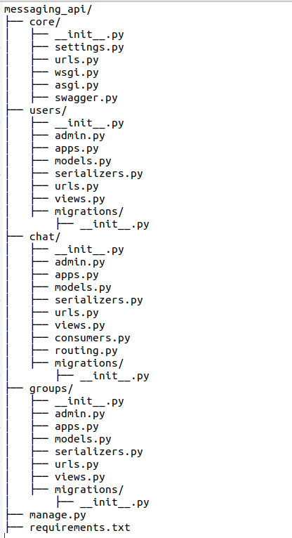

# Real Time Messaging and File Shareing API
This is a Django-based real-time messaging and file-sharing API. The project is dockerized and uses SQLite as the database.

## Prerequisites

- Docker

## Getting Started
## Build and Run the Docker Containers
Build the Docker containers:

```bash
docker-compose build
```
start the Docker containers:

```bash
docker-compose up
```

## Project Structure

[](https://github.com/Sagor0078/Real-Time-Messaging-and-File-Shareing-API)